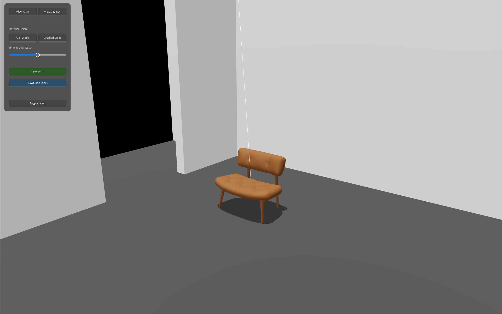

# Material Studio 🛋️

**[Live Demo](https://sqmmi3.dev/flux-studio/index.html)** | **[Portfolio](https://sqmmi3.dev)**

A real-time, interactive 3D B2B product configurator built with **Three.js** and **TypeScript**. This project was developed as a technical prototype to demonstrate advanced WebGL capabilities, including dynamic environment lighting, programmatic geometry manipulation, and client-side export generation.



## 🚀 Key Features
* **Dynamic Geometry:** Parametric scaling of the "Cabinet" module using matrix updates, demonstrating responsive 3D manipulation.
* **Material Management:** Instant swapping between physically based rendering (PBR) materials (Oak Wood vs. Brushed Steel) with accurate roughness and metalness maps.
* **Global Illumination & Lighting:** Features a dynamic "Day/Night" cycle using `PMREMGenerator` and `Math.smoothstep()` interpolation for realistic sunset/sunrise lighting transitions.
* **Shadow Optimization:** Implemented tight directional light frustums and optimized shadow map resolutions for crisp, professional-grade architectural shadows.
* **Exporters:** Custom client-side rendering pipeline to export transparent `.png` screenshots and `.txt` specification sheets directly from the canvas.

## 🛠️ Tech Stack
* **Core:** Three.js, TypeScript, WebGL
* **Build Tool:** Vite
* **UI:** Native HTML/CSS with Glassmorphism styling

## 🧠 Technical Highlights
* **Theater Set Architecture:** Designed the environment using a "diorama" layout (open walls) to allow natural environment map lighting while casting dramatic window shadows.
* **Performance:** Handled scene graph additions and removals cleanly, ensuring memory efficiency when swapping between the Chair and Cabinet views.

## 💻 Local Setup
```bash
npm install
npm run dev
